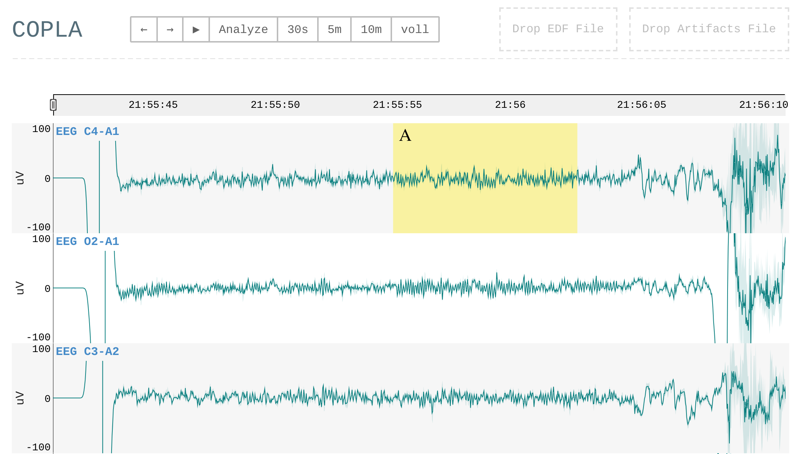

# copla-editor

Nachfolgeprojekt vom [EDF-Visualisierer](https://git.tools.f4.htw-berlin.de/somnonetz/EDF-Visualisierer).

<p align="center">
  
</p>


## Build

* Create the file `.env` and add the following:

```js
REACT_APP_XNAT_API_URL=http://localhost/xnat/REST
```

* Then run:

```sh
npm install
npm run build
```


## Develop

```sh
npm start
```


## Andere EDF-Viewer

- [SigViewer](https://github.com/cbrnr/sigviewer) (C++)
- [NSRR Cross Cohort EDF Viewer](https://sleepdata.org/community/tools/nsrr-edf-viewer) (Matlab)
- [EDFbrowser](https://github.com/Teuniz/EDFbrowser) (C++)
   - [The EDF format](https://www.teuniz.net/edfbrowser/edf%20format%20description.html)
   - [Some EDF/BDF testfiles](https://www.teuniz.net/edf_bdf_testfiles/)


## Verwandte Formate

- [Extensible Data Format (XDF)](https://github.com/sccn/xdf) ([Specifications](https://github.com/sccn/xdf/wiki/Specifications))
- [OpenXDF](http://www.openxdf.org/)


## Weitere Links

- [Canvas vs. SVG](http://www.hammerlab.org/2015/10/13/svg-canvas-the-pileup-js-journey/)
- [Dygrahps](https://github.com/danvk/dygraphs)
- [Dygraphs Dynamic Zooming Example](https://github.com/kaliatech/dygraphs-dynamiczooming-example)


## [Wiki](https://git.tools.f4.htw-berlin.de/somnonetz/copla-editor/wikis/home)
